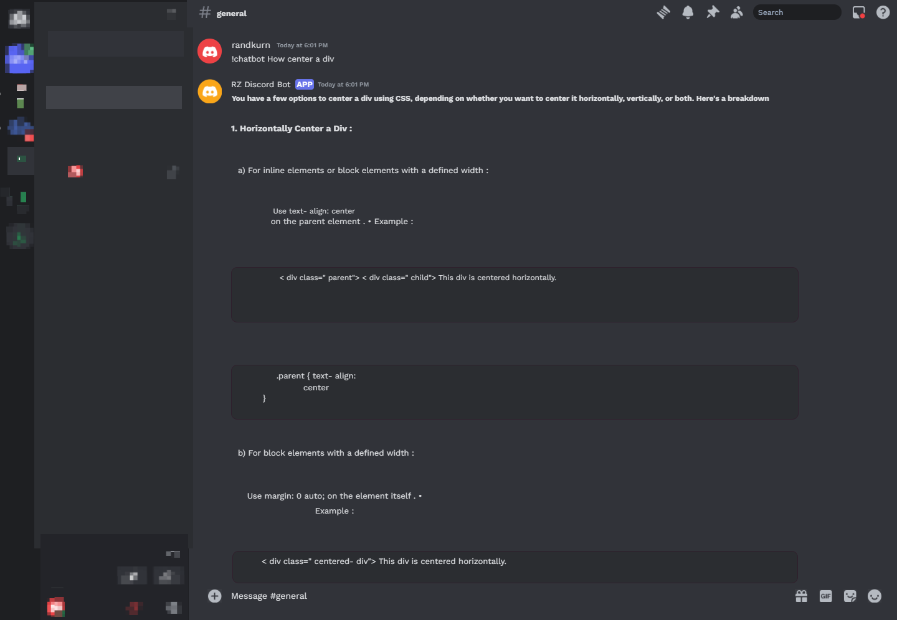

---

<div align="center">

<br>
</div>

# RZ Discord Bot with AI Integration

## Nama : Muhammad Randy Kurniawan 
## NIM  : 2405315
## Kelas: MKB 1C

## Deskripsi Projek
Projek ini adalah sebuah bot Discord yang terintegrasi dengan Kecerdasan Buatan (AI) menggunakan API dari OpenAI. Bot ini dapat melakukan percakapan secara dinamis dengan pengguna, menjawab pertanyaan, dan memproses perintah khusus terkait server SA-MP (San Andreas Multiplayer). Bot ini dirancang untuk komunitas SA-MP, dengan kemampuan untuk menampilkan informasi tentang server dan memberikan fitur interaktif melalui AI chatbot.

---

## Fitur Utama 📍
- **Menampilkan Status Server**: Mengambil dan menampilkan informasi tentang status server SA-MP, termasuk jumlah pemain yang sedang online.
- **Respon AI**: Bot dapat merespons pesan pengguna menggunakan teknologi pemrosesan bahasa alami (Natural Language Processing) dari OpenAI, melalui perintah `!chatbot [pesan]`.
- **Perintah Utilitas**: Termasuk perintah untuk menghapus pesan dalam jumlah besar (`/clear`) dan mengubah konfigurasi bot secara langsung.
- **Pencarian Informasi Ban**: Memungkinkan pencarian informasi ban menggunakan perintah SQL yang dapat diedit.

---

## Requirements ⚙️

Untuk menjalankan projek **RZ Discord Bot dengan AI Integration**, pastikan lingkungan pengembangan Anda memenuhi persyaratan berikut:

### 1. **Software**
- **Node.js** versi 16.x atau lebih baru.
- **npm** (Node Package Manager) yang sudah terinstal bersama Node.js.

### 2. **Dependencies** (Akan diinstal menggunakan `npm install`)
- **discord.js**: Library utama untuk mengontrol dan berinteraksi dengan API Discord.
- **openai**: Untuk mengakses model AI OpenAI yang diperlukan dalam pemrosesan percakapan.
- **dotenv**: Untuk mengelola konfigurasi sensitif seperti API key dan token secara aman.

### 3. **API Keys**
- **Discord Token**: Anda perlu mendaftarkan aplikasi di Discord Developer Portal untuk mendapatkan token yang dibutuhkan bot agar bisa berjalan.
- **OpenAI API Key**: Diperlukan untuk mengakses layanan OpenAI (misalnya GPT-3) untuk melakukan percakapan interaktif dengan bot.

### 4. **File Konfigurasi**
- **.env File**: File ini harus disiapkan di direktori utama projek untuk menyimpan kunci API. Contohnya:
  ```
  DISCORD_TOKEN=your-discord-token-here
  OPENAI_API_KEY=your-openai-api-key-here
  ```

### 5. **Permission Bot**
- Bot Discord harus memiliki akses ke channel dan izin untuk mengirim pesan dan membaca konten pesan.
- Pastikan bot diberi izin "Send Messages", "Read Message History", dan "Manage Messages" di server tempat bot akan dioperasikan.

---


## Cara Install 📝

### 1. Clone Repository
Pertama, clone repository dari GitHub ke dalam komputer Anda:
```bash
git clone https://github.com/randkurn/rz-discord-bot
cd rz-discord-bot
```

### 2. Install Dependensi
Install semua dependensi yang diperlukan, termasuk library untuk Discord.js dan OpenAI:
```bash
npm install
npm install openai dotenv
```

### 3. Konfigurasi API
Buat file `.env` di root directory dan tambahkan API Key dari OpenAI:
```
DISCORD_TOKEN=your-discord-token-here
OPENAI_API_KEY=your-openai-api-key-here
```

### 4. Menjalankan Bot
Setelah semua konfigurasi selesai, jalankan bot dengan perintah berikut:
```bash
node bot.js
```

---

## Contoh Penggunaan

- Ketik `!chatbot [pesan]` di channel Discord untuk mendapatkan respon dari AI.
- Ketik `/players` untuk menampilkan jumlah pemain yang sedang online di server SA-MP.
- Ketik `/clear [jumlah pesan]` untuk menghapus sejumlah pesan dari channel secara instan.


## Screenshot Demo Projek


---

## Integrasi AI

Projek ini menggunakan model kecerdasan buatan (AI) dari OpenAI yang berfungsi untuk melakukan percakapan dengan pengguna secara interaktif. Dengan menggunakan perintah `!chatbot`, bot dapat memproses pesan dan memberikan balasan yang sesuai berdasarkan konteks percakapan.

### Contoh Kode Integrasi AI:

```javascript
const { Client, GatewayIntentBits } = require('discord.js');
const openai = require('openai');
require('dotenv').config();

openai.apiKey = process.env.OPENAI_API_KEY;

const client = new Client({
    intents: [
        GatewayIntentBits.Guilds,
        GatewayIntentBits.GuildMessages,
        GatewayIntentBits.MessageContent
    ]
});

client.on('messageCreate', async message => {
    if (message.author.bot) return;

    if (message.content.startsWith('!chatbot')) {
        const userMessage = message.content.replace('!chatbot ', '');
        const response = await openai.createCompletion({
            model: 'text-davinci-003',
            prompt: userMessage,
            max_tokens: 150
        });

        message.channel.send(response.data.choices[0].text.trim());
    }
});

client.login(process.env.DISCORD_TOKEN);
```

---

## Link Repository GitHub
Untuk informasi lebih lanjut dan pengembangan lebih lanjut, Anda dapat mengunjungi repository GitHub Projek ini:
[Link ke Repository]([https://github.com/randkurn/rz-discord-bot])

---

